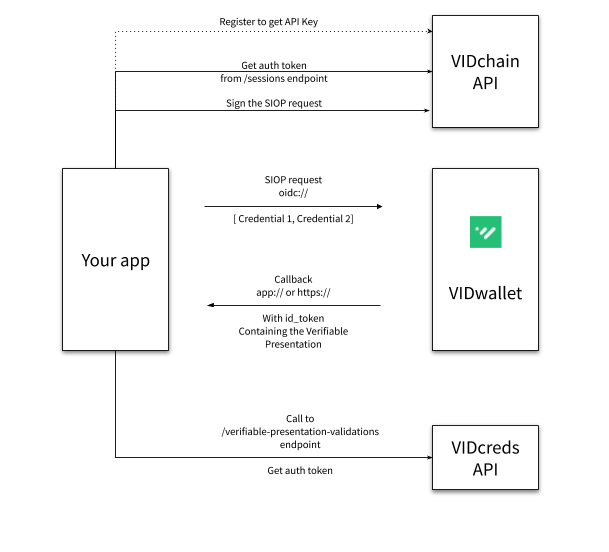

# Requesting credentials in the wallet from your app (app2app)

You can use the component `did-siop` to request credentials from the VIDwallet.

did-siop is a library written in Typescript that implements the SIOP (Self-Issued OpenID Provider) flavour using DIDs.

The current DID Auth implementation follows DID SIOP Auth, which uses two JSON Web Tokens (JWT) signed by both two parties DID keys in a double challenge-response authentication. It is also supported the protocol to exchange Verifiable Credentials as part of the ID token response.

## Verifiable Credentials exchange

This is the high-level flow of the steps required to exchange credentials:

Steps:
1. You need an API Key! Contact us, we'll create and provide it to you.
2. All calls to our API need to be authenticated. Use the API Key to request an authentication JWT.
3. Prepare your request to the wallet (need to sign it before sending).
4. Request the credentials you want to get in your app in the wallet. You need to provide the Credential Types you are requesting, and the "callback" url (a deep-link, so remember to register your deep-link from your app).
5. Almost done! You'll get a "callback" with the Verifiable Presentation with the requested credentials. 
6. Optional but **more than highly recommended**. Do a quick call to our Credentials API to verify the signature of the Verifiable Presentation and the claims we handed to you.

And voilà! You completed a full SSI exchange. You have the credentials, use and keep them wisely! 