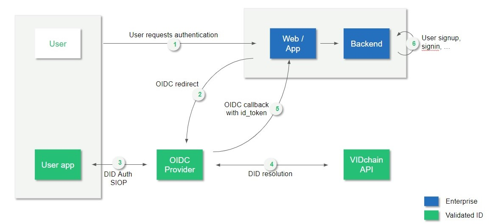
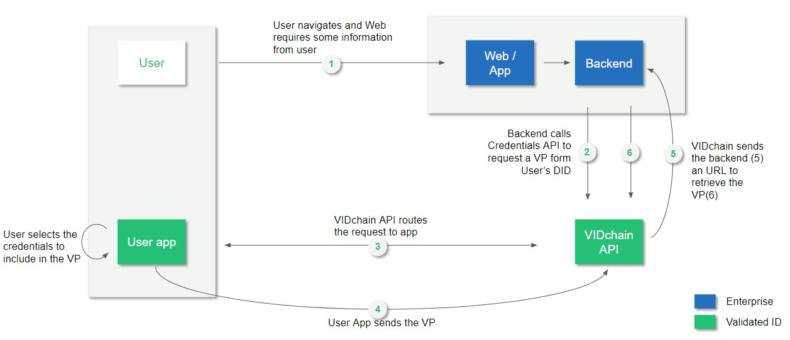
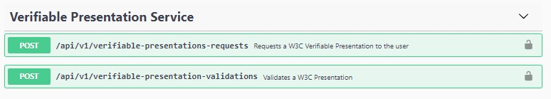
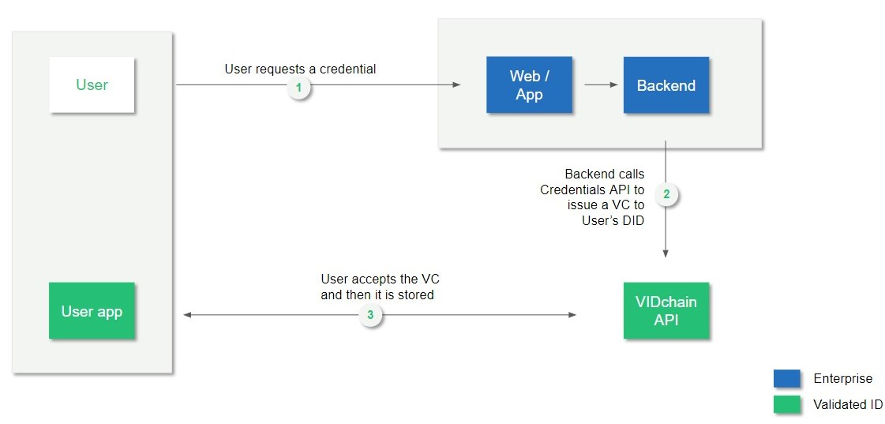

# Tutorial - Integrate your web or webapp with VIDchain

This tutorial contains guidelines to implement the following actions by means of consuming VIDChain API:

  - [OIDC flow for DID Auth](#oidc-flow-for-did-auth) 
  - [Request and Verify credentials](#request-and-verifying-a-presentation)
  - [Issue Credentials](#issue-credentials)
  
We will follow this user journey in order to illustrate the Tutorial:
1. A User gets his first credential by going through a liveliness process that involves scanning his ID card.
2. The user logs in and authenticates to a government site where he is requested to present a Verifiable ID.
3. Once the user is authenticated, he requests a new credential, issued by the government.
4. Finally, the user presents this credential to his university in order to get a discount.

### Demo example: Issuing our first credential
For the sake of the Tutorial we’ll use the built-in liveliness detection to create a *Verifiable ID* from within the VIDwallet.

To do so, open the VIDwallet, and select the (+) icon on the top right corner, and then ID Card icon.

Follow the steps to verify your ID and at the end you will receive your first verifiable credential!

Then we will login into a fake Government site and issue a credential to the authenticated user.

## Authenticating users with OIDC flow

You will need to configure your web application to initiate an OpenID Connect flow towards VIDchain’s OpenID provider, and set up a callback URL to receive the Authorization Code and request the id_token.

?> NOTE: We strongly recommend the use of an OpenID client library like AppAuth-JS or JSO-OAuth2. Alternatively, you can find a comprehensive list of other certified products on the OpenID website: https://openid.net/developers/certified/ or in https://oauth.net/code/

### Flow from a web application on a desktop browser

The flow itself works as follows:

1. The user requests authentication through VIDChain.
2. The OpenID Connect Client initiates an Authorize Code flow. The user's user agent is redirected to `https://api.vidchain.net/oauth2/auth?client_id=...&redirect_uri=...`

    If unable to authenticate the user (= no session cookie exists), the user agent is redirected to the Login URL, where the user is shown a QR code.
  
3. The user scans the QR code to authenticate with the wallet app.
4. The DID Auth process is performed.
5. The user is redirected to the Client’s `/callback` url along with the Authorization Code.
6. The web application sitting on the callback URL can get the `id_token` from the OIDC Provider using the Authorization Code.

On the `id_token` you will receive the DID the user used to authenticate using DID Authentication.

## Requesting (and verifying) a presentation
Once the user has been authenticated we can start interacting with his DID using the VIDchain API.

This is the diagram of the full flow of presentation request and verification:

### Request presentation

Let's ask him to present his credentials to identify and authorize him.

To do so, we just need to call the `Verifiable Presentation Service` of the VIDchain API.

Following our example, here’s the payload sent to the `/api/v1/verifiable-presentations-requests` to request a `“VerifiableIdCredential”`:

    {
      "target": "did:vid:0xAf3fAf5F4618a096d242B8f3F8B35748Ca9F64d5",
      "type": [
        [ “VerifiableCredential”,“VerifiableIdCredential”]
      ]
    }

The user will receive a Presentation Request on his wallet. If he accepts the request, the Wallet will generate a presentation and will send it to the VIDchain API.

### Retrieve the presentation

The VIDchain API will store the Verifiable Presentation into the requester’s Hub.

VIDchain API will perform a POST to `callbackUrl` that you defined on the onboarding process and will send a payload:

    {
      "message": "Your requested presentation is ready to be downloaded.",
      "url": “https://api.vidchain.net/api/v1/attributes/0xc5d2460186f7233c927e7db2dcc703c0e500b653ca82273b7bfad8045d85a470”
    }

You can retreive the presentation on the URL received. 

## Issue Credentials

On the following schema we see the flow required to issue a credential using VIDchain:

1. The user requests a credential.
2. The entity application call VIDChain Credentials API to issue a VC to User’s DID.
3. The user’s wallet receives a notification in wallet.
4. The user accepts the credential and it’s stored in the wallet.

